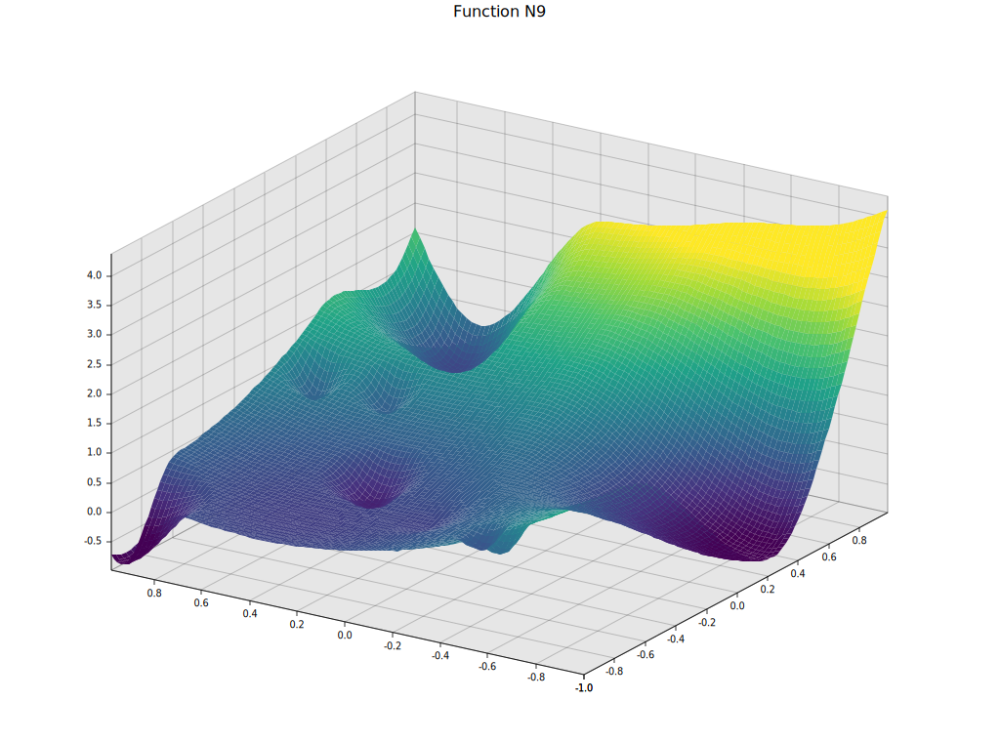

# gkls-rs
`gkls-rs` is a pure Rust implementation of the algorithm described in
[Software for Generation of Classes of Test Functions with Known Local and Global Minima for Global Optimization](https://arxiv.org/abs/1103.2695).

Although much of the code is mostly translated from the original C implementation, in this implementation
it is possible to define independent problems without the need to modify any global state. That particular
point made the usage of the original quite unwieldy when trying to run parallel code in benchmarks.

The original implementation is located at the [ACM Collected Algorithms repository](https://netlib.org/toms/) on entry number 829.
The folder `gkls` is a copy of those contents, it is used to test the Rust implementation.

With the feature `test_cbinding` the original C implementation and test suite is built.
The test-suite compares the output of the Rust and C implementations. The output must be equivalent.
Thus, the function numbers from the original paper and subsequent studies on each function are still valid.

Here is the function from the original paper reproduced with `gkls-rs`:


The figure is generated with the binary in `examples/plot_function`.
```
cargo run --example plot_function --features examples
```

See `examples/single_evaluation.rs` for a simple usage example:
```
// Generate a problem
let problem = Problem::new(9, Options::default(), 2, 10, -1.0, 1. / 3., 2. / 3.)
    .expect("Problem has to be valid");
// Evaluate the proble with the appropiate function
let x = [0.23, 0.44];
let y = problem.d_func(&x);
let dy = problem.d_gradient(&x);
println!("f({x:?})={y}");
println!("f'({x:?})={dy:?}");
```
Run the example with:
```
cargo run --example single_evaluation --features examples
```
You should get something like:
```
f([0.23, 0.44])=0.8938503184432863
f'([0.23, 0.44])=Some([1.8828658375478264, 0.17383184854469846])
```
